<!--
**chriswells0/chriswells0** is a ✨ _special_ ✨ repository because its `README.md` (this file) appears on your GitHub profile.

Here are some ideas to get you started:

- 🔭 I’m currently working on ...
- 🌱 I’m currently learning ...
- 👯 I’m looking to collaborate on ...
- 🤔 I’m looking for help with ...
- 💬 Ask me about ...
- 📫 How to reach me: ...
- 😄 Pronouns: ...
- ⚡ Fun fact: ...
-->

<!--
References and more ideas:

* https://github.com/anuraghazra/github-readme-stats
* https://github.com/gh-metrics/metrics
* Add recent blog posts: https://www.sitepoint.com/github-profile-readme/
-->

    

    
    
    
    
    

    

        <picture>
            <source
              srcset="./profile/stats-dark.svg"
              media="(prefers-color-scheme: dark)"
            />
            <source
              srcset="./profile/stats-light.svg"
              media="(prefers-color-scheme: light), (prefers-color-scheme: no-preference)"
            />
            
        </picture>
    

    

        <picture>
            <source
              srcset="./profile/top-langs-dark.svg"
              media="(prefers-color-scheme: dark)"
            />
            <source
              srcset="./profile/top-langs-light.svg"
              media="(prefers-color-scheme: light), (prefers-color-scheme: no-preference)"
            />
            
        </picture>
    

    <picture>
        
    </picture>

    

    
    
    
    
    

